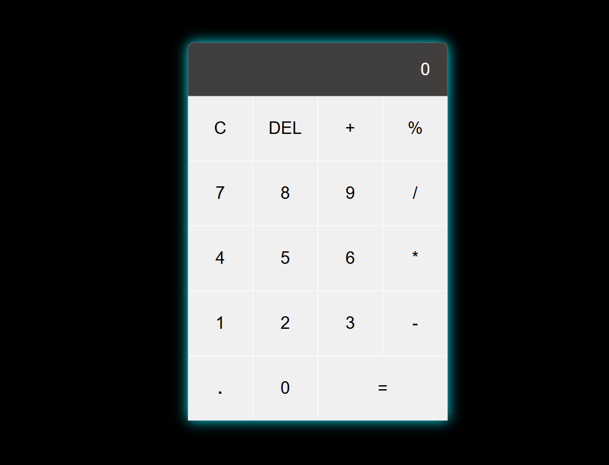

# JS Calculator

**JS Calculator** is a simple calculator built using **HTML**, **CSS**, and **JavaScript**.
It supports basic arithmetic operations and is a great project for beginners to understand how JavaScript interacts with the DOM.

---

## Features

- Add, Subtract, Multiply, Divide
- Clear (`C`) and Delete (`DEL`) buttons
- Real-time result display
- Styled user interface using CSS
- Handles long numbers with text wrapping

---

## Technologies Used

- **HTML5** – To create the structure of the calculator
- **CSS3** – For styling the calculator UI and layout
- **JavaScript (ES6)** – For functionality and button interactions

---

## JavaScript Concepts Used

- `getElementById()` and `getElementsByTagName()`
- `onclick` event handling
- `innerText` manipulation
- `eval()` for expression evaluation
- `substring()` or `slice()` for delete functionality
- Conditional logic and string operations
- `try...catch` for error handling

---

## Project Structure

JS-Calculator/
│
├── index.html # HTML structure
├── style.css # CSS styles
└── script.js # JavaScript functionality

## Preview

## How to Use

1. Clone or download the repo  
2. Open `index.html` in your browser  
3. Click the buttons to perform calculations!

## Author

**Manoj Kumar Reddy**

---

Feel free to fork or contribute to this project if you'd like to extend its features! 
